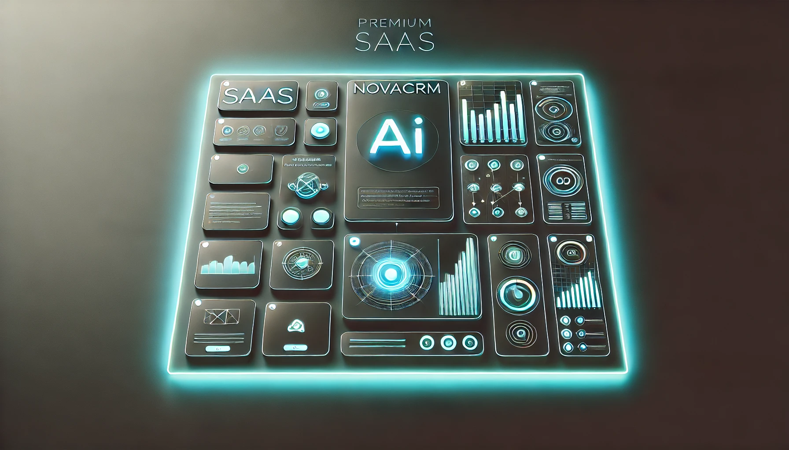
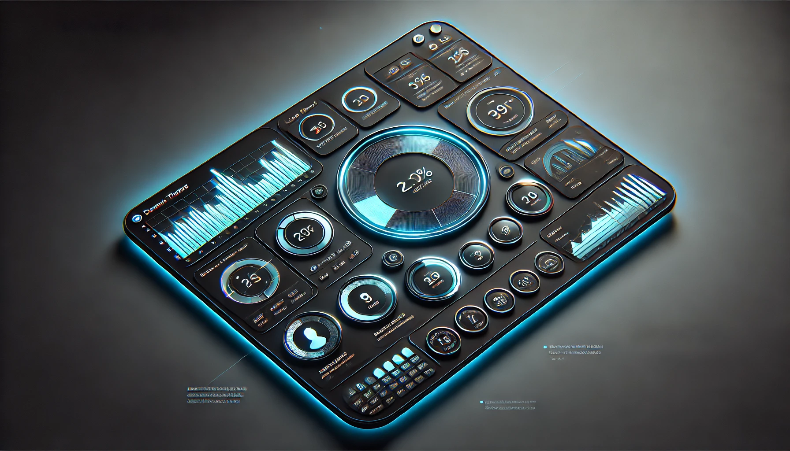
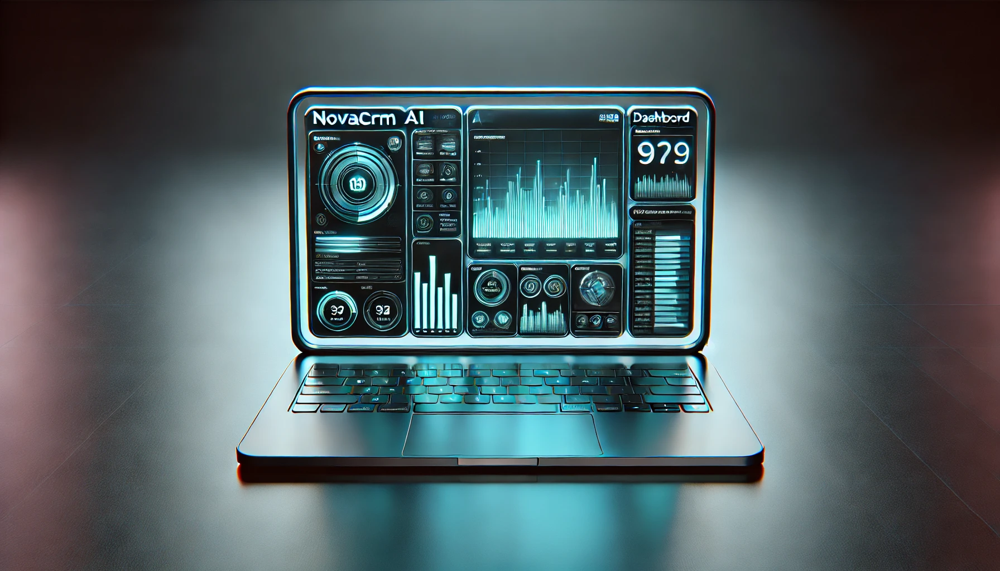
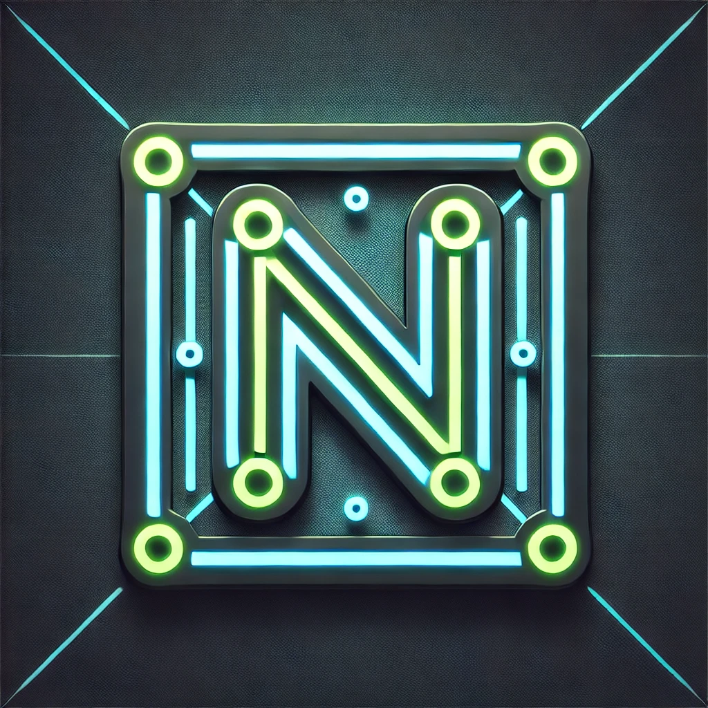

# 🚀 NovaCRM AI  
CRM moderno, modular y potenciado con arquitectura preparada para IA.

NovaCRM AI es un CRM profesional construido con **Next.js 14**, **Prisma ORM v7**, **PostgreSQL**, **Zod**, **Recharts**, y una UI moderna estilo SaaS.  
Forma parte del ecosistema de proyectos profesionales de **KarlCamarodev**.

---

## 📌 Vista general del proyecto

### 🖼 Hero (Página principal)

### 📊 Dashboard

### 👥 Módulo de clientes

### 💻 Mockup del sistema

### 🔷 Icono oficial del sistema

---

# ✨ Características principales

### ✔ Gestión de Clientes (Módulo Activo)
- Crear clientes con validación estricta mediante **Zod**.  
- Almacenamiento seguro usando **Prisma + PostgreSQL**.  
- Campos opcionales normalizados (email, empresa, notas).  
- Estado del cliente: `ACTIVE`, `INACTIVE`, `LEAD`.  
- Listado actualizado en tiempo real con el App Router de Next.js.  
- UI profesional estilo SaaS con modo oscuro.

---

# 📊 Dashboard Inteligente

Implementado con **Recharts**, incluye:

- Métricas principales  
- Nuevos clientes por día (últimos 7 días)  
- Distribución por estado  
- Diseño responsive y minimalista  

---

# 🧩 Arquitectura del Proyecto

### Tecnologías principales

| Tecnología | Uso |
|-----------|-----|
| **Next.js 14** | App Router, API Routes, Server Actions |
| **Prisma ORM v7** | Base de datos y modelos relacionales |
| **PostgreSQL** | Base de datos principal |
| **Zod** | Validación estricta |
| **Recharts** | Visualización de datos |
| **TypeScript** | Tipado estricto |

---

# 🗂 Estructura del proyecto

# 🚀 NovaCRM AI  
CRM moderno, modular y potenciado con arquitectura preparada para IA.

NovaCRM AI es un CRM profesional construido con **Next.js 14**, **Prisma ORM v7**, **PostgreSQL**, **Zod**, **Recharts**, y una UI moderna estilo SaaS.  
Forma parte del ecosistema de proyectos profesionales de **KarlCamarodev**.

---

## 📌 Vista general del proyecto

### 🖼 Hero (Página principal)

### 📊 Dashboard

### 👥 Módulo de clientes

### 💻 Mockup del sistema

### 🔷 Icono oficial del sistema

---

# ✨ Características principales

### ✔ Gestión de Clientes (Módulo Activo)
- Crear clientes con validación estricta mediante **Zod**.  
- Almacenamiento seguro usando **Prisma + PostgreSQL**.  
- Campos opcionales normalizados (email, empresa, notas).  
- Estado del cliente: `ACTIVE`, `INACTIVE`, `LEAD`.  
- Listado actualizado en tiempo real con el App Router de Next.js.  
- UI profesional estilo SaaS con modo oscuro.

---

# 📊 Dashboard Inteligente

Implementado con **Recharts**, incluye:

- Métricas principales  
- Nuevos clientes por día (últimos 7 días)  
- Distribución por estado  
- Diseño responsive y minimalista  

---

# 🧩 Arquitectura del Proyecto

### Tecnologías principales

| Tecnología | Uso |
|-----------|-----|
| **Next.js 14** | App Router, API Routes, Server Actions |
| **Prisma ORM v7** | Base de datos y modelos relacionales |
| **PostgreSQL** | Base de datos principal |
| **Zod** | Validación estricta |
| **Recharts** | Visualización de datos |
| **TypeScript** | Tipado estricto |

---

# 🗂 Estructura del proyecto

# 🚀 NovaCRM AI  
CRM moderno, modular y potenciado con arquitectura preparada para IA.

NovaCRM AI es un CRM profesional construido con **Next.js 14**, **Prisma ORM v7**, **PostgreSQL**, **Zod**, **Recharts**, y una UI moderna estilo SaaS.  
Forma parte del ecosistema de proyectos profesionales de **KarlCamarodev**.

---

## 📌 Vista general del proyecto

### 🖼 Hero (Página principal)

### 📊 Dashboard

### 👥 Módulo de clientes

### 💻 Mockup del sistema

### 🔷 Icono oficial del sistema

---

# ✨ Características principales

### ✔ Gestión de Clientes (Módulo Activo)
- Crear clientes con validación estricta mediante **Zod**.  
- Almacenamiento seguro usando **Prisma + PostgreSQL**.  
- Campos opcionales normalizados (email, empresa, notas).  
- Estado del cliente: `ACTIVE`, `INACTIVE`, `LEAD`.  
- Listado actualizado en tiempo real con el App Router de Next.js.  
- UI profesional estilo SaaS con modo oscuro.

---

# 📊 Dashboard Inteligente

Implementado con **Recharts**, incluye:

- Métricas principales  
- Nuevos clientes por día (últimos 7 días)  
- Distribución por estado  
- Diseño responsive y minimalista  

---

# 🧩 Arquitectura del Proyecto

### Tecnologías principales

| Tecnología | Uso |
|-----------|-----|
| **Next.js 14** | App Router, API Routes, Server Actions |
| **Prisma ORM v7** | Base de datos y modelos relacionales |
| **PostgreSQL** | Base de datos principal |
| **Zod** | Validación estricta |
| **Recharts** | Visualización de datos |
| **TypeScript** | Tipado estricto |

---

# 🗂 Estructura del proyecto

nova-crm-ai/
│
├── prisma/
│── src/
│ ├── app/
│ │ ├── dashboard/
│ │ ├── clients/
│ │ └── api/clients/route.ts
│ ├── lib/prisma.ts
│
├── docs/screenshots/
│ hero.webp
│ dashboard.webp
│ clients-module-mockup.webp
│ laptop-mockup.webp
│ logo.webp
│
├── public/
└── README.md
👨‍💻 Autor

Karl Camarodev
Desarrollador Fullstack | Arquitecto de Software

GitHub: https://github.com/Karlcamarodev

📄 Licencia

MIT License.